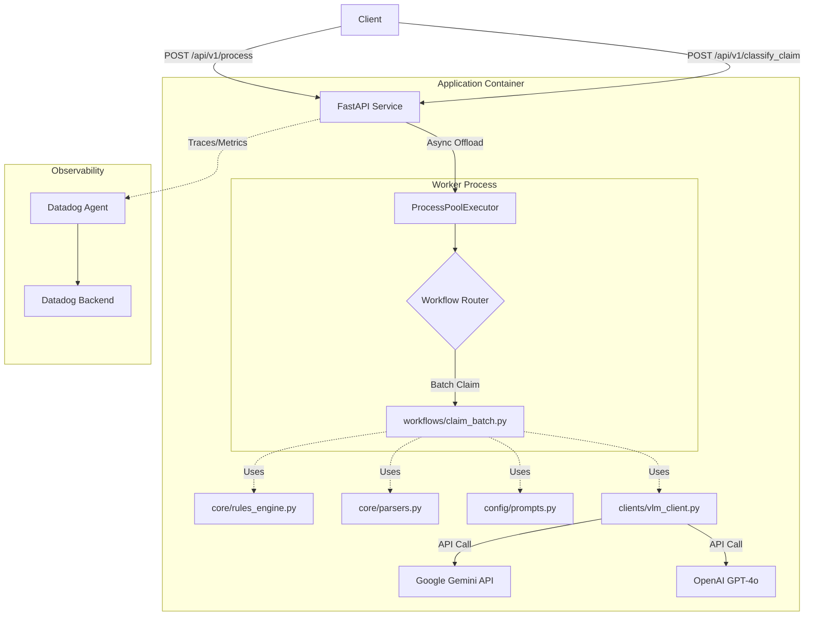

# System Architecture

## Overview

The **Stateless Extraction Service POC** is a Python-based FastAPI application designed to extract structured financial data (invoices, receipts) from documents (PDFs, Images) using Large Language Models (LLMs) and Vision Language Models (VLMs).

## High-Level Architecture

The system follows a stateless, containerized microservice architecture optimized for serverless deployment (e.g., Google Cloud Run, AWS App Runner).



## Core Components

The application evolved from a monolithic extraction script into a modular architecture to improve maintainability and testability:

### 1. API Layer (`main.py`)
- **Framework**: FastAPI
- **Concurrency Model**: Uses `asyncio` for I/O-bound web handling and `ProcessPoolExecutor` for CPU-bound document processing. This prevents the main event loop from blocking during heavy image conversions or JSON parsing.
- **Endpoints**:
  - `POST /api/v1/process`: Processes a single document using the Three-Tier Agent.
  - `POST /api/v1/classify_claim`: Processing batch documents for a complete expense claim, reconciling extracted amounts against the requested payload.
  - `GET /health`: Health check endpoint for container orchestration.

### 2. Workflows (`workflows/`)
Contains the orchestration logic for extraction use cases.
- **`three_tier.py`**: A multi-agent workflow for extracting data from a single document.
- **`claim_batch.py`**: Orchestrates the classification and extraction of a batch of documents, applies deterministic rule logic to evaluate the batch, and validates it against an incoming API payload.

#### Batch Claim Processing Workflow (`workflows/claim_batch.py`)
This workflow is triggered via the `/api/v1/classify_claim` endpoint to handle complex expense claims involving multiple supporting documents.

*   **Stage 1: Classification & Extraction (`_classify_and_extract_document`)**
    *   **Goal**: Initial structured data extraction and classification for every individual document in the batch.
    *   **Input**: Document Images + Classification System Prompt.
    *   **Mechanism**: Each document is sent to the VLM to classify it into specific categories (e.g., "ใบเสร็จรับเงิน/ใบกำกับภาษี หรือ บิลเงินสด" [Tax Invoices/Receipts], "รายงานการเดินทาง" [Travel Reports]). The VLM extracts relevant fields specific to that document type natively.
    *   **Compliance Rule**: If a document is classified as a receipt/tax invoice, a secondary Compliance Auditor agent is automatically launched to check it against business policies (e.g., explicit BDI policies, Tax ID validation).

*   **Stage 2: Batch Rule Evaluation (`core/rules_engine.py -> determine_claim_category`)**
    *   **Goal**: Determine the overarching claim category for the entire submission based on the combination of classified documents.
    *   **Mechanism**: Uses deterministic subset logic to evaluate the batch. 
        *   It builds a set of the distinct `document_class` types found across all files.
        *   It checks this set against predefined requirement matrices. For example, to classify a batch as an Accommodation Claim ("ค่าที่พัก"), the set of uploaded documents *must* contain a Receipt, an Empeo Form, a Travel Report, an Itinerary, and a Hotel Folio.
        *   If multiple claim types require the exact same documents (e.g., Train, Bus, Taxi claims all require the same 4 forms), it inspects the deeper VLM-extracted details (the `receipt_type`) to break the tie and deduce the exact category.
    *   **Output**: Identifies the resolved claim category, or marks it "INCOMPLETE" if the required set of documents is missing.

*   **Stage 3: Payload Validation**
    *   **Goal**: Ensure the extracted data matches the user-submitted JSON API payload (`ClaimSubmitRequest`).
    *   **Checks**:
        *   **Global Total Amount**: Iterates through every extracted document, parses out its relevant total (handling different schema paths like `total_amount` vs `folio_details.total_charges`), and verifies the sum equals the `amount_total` provided in the root request.
        *   **Sub-Request Correlation**: Matches sub-requests (`request_documents`) against the corresponding extracted documents (linked by filename prefixes). It ensures that the sum of the physical documents attached to a sub-request matches the claimed `amount`, and that the requested `activity` aligns with the actual extracted document classes.
    *   **Output**: A finalized JSON structure containing validation errors (if any mismatches occur), the resolved claim category, missing documents, and extracted details for the entire batch.

### 3. Core Logic (`core/`)
- **`rules_engine.py`**: Contains deterministic validation logic used by the Controller stage and batch classification logic.
- **`parsers.py`**: Robust JSON parsing utilities for handling VLM output.

### 4. Configuration & Prompts (`config/`)
- **`prompts.py`**: Centralized storage for all System and User Prompts used by the LLMs/VLMs.

### 5. Clients (`clients/`)
- **`vlm_client.py`**: Standardized interface for preparing document images and making API calls to external providers (e.g., Gemini).

### 6. Observability (`telemetry.py` & `OBSERVABILITY.md`)
- **Provider**: Datadog (APM & LLM Observability).
- **Implementation**:
  - **Tracing**: Uses `ddtrace` to trace request lifecycles.
  - **LLM Observability**: Uses `LLMObs` SDK to capture specific GenAI operations (Prompts, Model Responses, etc.).

## Deployment Architecture

The application is packaged as a Docker container adhering to serverless best practices.

*   **Base Image**: `python:3.11-slim`
*   **Dependency Management**: Uses `uv` for fast dependency installation.
*   **Entrypoint**: Uses `datadog/serverless-init` to wrap the application process.
*   **Process**: `uvicorn` running the FastAPI app.

## Project Structure

```
/
├── main.py              # API Entry point & Worker management
├── workflows/           # Extraction orchestrations (three_tier, claim_batch)
├── core/                # Deterministic logic (rules_engine, parsers)
├── clients/             # External API interfaces (vlm_client)
├── config/              # Centralized configuration and prompts
├── schemas/             # Optional structured data schemas
├── telemetry.py         # Datadog/Observability wrappers
├── Dockerfile           # Container definition
├── requirements.txt     # Python dependencies
├── USAGE.md             # User guide for API usage
├── OBSERVABILITY.md     # Detailed telemetry documentation
└── ref-code/            # Reference implementations
```

## Data Flow

1.  **Request**: User uploads file(s) to `/api/v1/process` or `/api/v1/classify_claim`.
2.  **Preprocessing**: Server validates file type and streams it to a temporary location.
3.  **Dispatch**: Task is submitted to `ProcessPoolExecutor`.
4.  **Extraction**: Task calls the appropriate workflow in `workflows/` (e.g., `three_tier_process_document`), which leverages `core/`, `clients/`, and `config/` to process the document.
5.  **Telemetry**: Traces and LLM details are pushed to Datadog asynchronously via `telemetry.py`.
6.  **Response**: Structured JSON is returned to the user.
