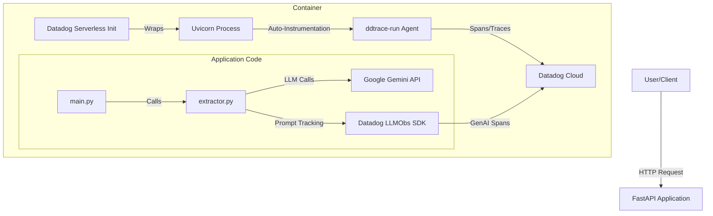

# Observability Architecture

This document details the observability implementation for the Content Process API, utilizing Datadog for APM Tracing and LLM Observability.

## Architecture Overview

The system uses a sidecar/init-process approach suitable for serverless environments (like AWS App Runner or Google Cloud Run).



### Components

1.  **Datadog Serverless Init (`/app/datadog-init`)**:
    *   Acts as the container `ENTRYPOINT`.
    *   Initialize the Datadog agent/forwarder within the container environment.
    *   Ensures traces and logs are flushed before the container shuts down.

2.  **Datadog Tracer (`ddtrace`)**:
    *   `ddtrace-run`: Automatically instruments the `uvicorn` process and supported libraries (FastAPI, Requests, etc.).
    *   `ddtrace` library: Used programmatically for manual instrumentation and LLM Observability.

3.  **LLM Observability (`LLMObs`)**:
    *   Specialized tracking for Generative AI calls.
    *   Captures prompts, templates, variables, and model responses.

---

## Implementation Details

### 1. Docker Injection (`Dockerfile`)
We inject the Datadog serverless binary and set it as the entrypoint.

```dockerfile
# 1. Copy the binary from the official Datadog image
COPY --from=datadog/serverless-init:1 /datadog-init /app/datadog-init

# 2. Set environment variables
ENV PATH=/usr/local/bin:$PATH

# 3. Set as Entrypoint
ENTRYPOINT ["/app/datadog-init"]

# 4. Run application with auto-instrumentation
CMD ["ddtrace-run", "uvicorn", "main:app", ...]
```

### 2. Telemetry Wrapper (`telemetry.py`)
To maintain compatibility with existing code (which previously used OpenTelemetry), we implemented wrappers:

*   **Initialization**: Sets up `LLMObs` using environment variables.
*   **Likeness Wrappers**:
    *   `TracerWrapper`: Maps `start_as_current_span` (OTel style) to `ddtrace.tracer.trace`.
    *   `MockMetric`: Stubs out metric calls (`add`, `record`) to prevent `main.py` from crashing, as Datadog uses `statsd` which can be implemented later.

```python
# telemetry.py logic
try:
    if os.getenv("DD_API_KEY"):
        LLMObs.enable(..., agentless_enabled=True)
```

### 3. Prompt Tracking (`extractor.py`)
We use `LLMObs.annotation_context` to wrap the actual Gemini API call. This captures the exact prompt template and variables used.

```python
# extractor.py
with LLMObs.annotation_context(prompt={
    "id": "gemini-extraction-template",
    "template": system_prompt,
    "variables": {"parts_count": len(parts)}
}):
    response = gemini_client.models.generate_content(...)
```

---

## Configuration

The system is configured via environment variables in `.env`:

| Variable | Description | Example |
| :--- | :--- | :--- |
| `DD_API_KEY` | Your Datadog API Key | `abc123...` |
| `DD_SITE` | Datadog Site Region | `us3.datadoghq.com` |
| `DD_SERVICE` | Service Name in Datadog | `content-process-api` |
| `DD_ENV` | Environment | `dev` |
| `DD_LLMOBS_ML_APP` | ID for LLM Observability Application | `content-process` |
| `DD_LOGS_INJECTION` | Inject Trace IDs into logs | `true` |
| `DD_TRACE_ENABLED` | Enable Tracing | `true` |

---

## Verification

To verify the system is working:

1.  **Build** the container:
    ```bash
    docker build -t poc-local-api .
    ```

2.  **Run** with env vars:
    ```bash
    docker run -d --name poc-test --env-file .env -p 8005:8000 poc-local-api
    ```

3.  **Trigger** a request:
    ```bash
    curl -X POST "http://localhost:8005/api/v1/process" \
      -F "file=@test/invoice2.pdf" \
      -F "extractor_type=gemini"
    ```

4.  **Check Datadog**:
    *   **APM**: Look for `content-process-api` service.
    *   **LLM Observability**: Look for the `gemini-extraction-template` prompt traces.
