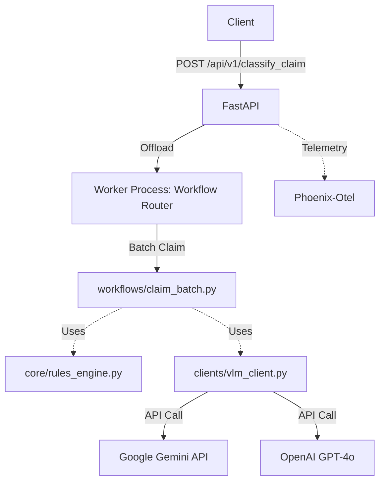
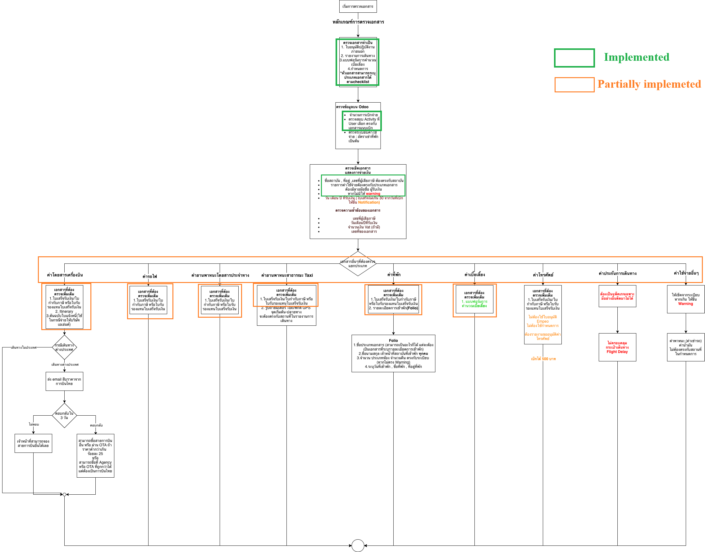

# Stateless Extraction Service POC

A Python-based FastAPI application designed to extract structured financial data (invoices, receipts) from documents (PDFs, Images) using Large Language Models (LLMs) and Vision Language Models (VLMs).

## Key Features

-   **Batch Claim Processing**: Upload entire expense claims with multiple documents. The system will extract data, identify document types, and validate the sum of line items against the claimed totals.
-   **Compliance & Rule Engine**: Deterministic classification logic groups documents together based on configured rules (e.g., matching flight itineraries with e-receipts) and runs policy compliance checks against Thai Taxation requirements (BDI checks).
-   **Stateless Microservice**: Optimized for serverless deployment (Google Cloud Run, AWS App Runner, Azure Container Apps).
-   **Multi-Model Support**: Currently routes through a unified `VLMClient` supporting interactions with both **Google Gemini API** and **OpenAI GPT-4o**.
-   **Observability**: Fully instrumented with Datadog for distinct Traces, Metrics, and LLM Observability.
-   **Async Processing**: Uses `ProcessPoolExecutor` for CPU-bound document processing to keep the API responsive under high-load AI tasks.

## Architecture

The system follows a modular, containerized microservice architecture. For a detailed deep dive, see [ARCHITECTURE.md](ARCHITECTURE.md).



## Prerequisites

-   Python 3.11+ (if running locally)
-   Docker (if running containerized)
-   Google Gemini API Key or OpenAI API Key
-   (Optional) Phoenix API Key for telemetry

## Installation & Local Setup

**Configuration**
Create a `.env` file in the root directory:
```env
# Required at least one VLM key
GOOGLE_API_KEY=your_gemini_api_key
GEMINI_MODEL_ID=your_gemini_model_id
# or
OPENAI_API_KEY=your_openai_api_key
AZURE_OPENAI_ENDPOINT=your_azure_openai_endpoint
AZURE_OPENAI_DEPLOYMENT_NAME=your_azure_openai_deployment_name

# Optional: Observability
PHOENIX_API_KEY
PHOENIX_COLLECTOR_ENDPOINT
PHOENIX_GRPC_PORT
```

## Docker Support

The application is bundled for immediate deployment via Docker.

### 1. Build the Image
```bash
docker build -t extraction-service .
```

### 2. Run the Container
You can safely map your `.env` variables into the container environment:
```bash
docker run --env-file .env -p 8000:8000 extraction-service
```
Once running, the API will be available at `http://localhost:8000`.

## API Usage

The main objective of the service is to process hierarchical claims via the batch API. The API accepts a detailed JSON payload detailing the requested expense claim, along with the supporting documents encoded as base64 strings.

### Endpoint: `POST /api/v1/classify_claim`

**Query Parameters:**
- `model_provider`: Optionally choose your LLM (`gemini` or `gpt-4o`). Defaults to `gemini`.

**JSON Body payload (`ClaimSubmitRequest` schema):**
- `request_id` (str): Unique identifier for the overall claim.
- `amount_total` (float): The total expected sum of the entire claim.
- `attachments` (list): Any high-level attachments not tied to a specific sub-request.
- `request_documents` (list): An array of specific sub-requests/line-items making up the claim.
  - `request_document_id` (str): Unique ID for the line-item.
  - `activity` (str): Expected expense category (e.g., "ค่าโดยสารเครื่องบิน").
  - `amount` (float): Expected subtotal for this line-item.
  - `attachments` (list): Crucial list containing `{ "filename": "...", "base64": "JVBER..." }` dictionaries of the actual supporting files (Receipts, Folios, Empeo docs) associated with this specific line-item expense.

**Example Request:**
```json
{
  "request_id": "RQ-69-00103",
  "amount_total": 135200.00,
  "attachments": [],
  "request_documents": [
    {
      "request_document_id": "RQ-69-00103-1",
      "activity": "ค่าโดยสารเครื่องบิน",
      "amount": 135200.00,
      "paid_by": "employee",
      "expense_date_or_commit": "21/01/2026",
      "attachments": [
        {
          "filename": "E-receipt.pdf",
          "base64": "JVBERi0xLjQK..."
        }
      ]
    }
  ]
}
```

**Example Response:**
The service will return a detailed breakdown of the batch extraction, including whether the provided documents met business rules, math validations against the payload, and structured data extracted natively from the images.

```json
{
  "claim_category": "ค่าโดยสารเครื่องบิน",
  "missing_documents": [],
  "status": "COMPLETE",
  "message": "Processed successfully.",
  "validation_results": [],
  "extracted_documents": [
    {
      "document_class": "ใบเสร็จรับเงิน/ใบกำกับภาษี หรือ บิลเงินสด",
      "receipt_type": "Flight",
      "identity": { "issuer": { "name": "THAI AIRWAYS INTERNATIONAL PUBLIC CO., LTD." } },
      "total_amount": 135200.0,
      "filename": "RQ-69-00103-1_E-receipt.pdf"
    }
  ]
}
```

## Running Tests

To test the application locally without formatting raw cURL requests, the repository includes end-to-end Python test scripts.

1.  Ensure your server is running (either locally or via Docker mapping port 8000).
2.  Install `requests`: `pip install requests`
3.  Execute a test script:
    
    ```bash
    python test_true_positive.py
    ```
    
    By default, it calls `http://127.0.0.1:8000/api/v1/classify_claim`. It reads documents from the `test/true_positive/` directory, encodes them to base64, packages the schema, hits the API, and automatically saves the detailed JSON extraction result into the `test_result/` directory.

## Documentation

-   [Architecture Overview](ARCHITECTURE.md)
-   [Observability Setup](OBSERVABILITY.md)
-   [Troubleshooting](TROUBLESHOOTING.md)
-   [Azure Deployment Guide](AZURE-DEPLOYMENT-GUIDE.md)

## Current State


Legend: 
- Implemented : Fully functional data extraction and validation.
- Partially Implemented : Only data extraction, no compliance auditor implemented yet.

## Next Step

1. Create a larger test set.
The system would benefit from additional document variants, such as messy e‑receipts and other low‑quality formats.

2. Evaluate the speed–accuracy trade‑off in VLM-based classification.
Currently, the system calls the VLM separately for each document, which increases total inference time. We should investigate alternative approaches, such as batch inference, to improve efficiency.

3. Monitor LLM performance.
For example, we can use an LLM as a judge to make the system’s stochastic processes (LLM calls) more reliable, consistent, and transparent.

4. Add more document templates for the extraction process.
These templates should be included in CLASSIFIER_SYSTEM_PROMPT within @config/prompts.py.
